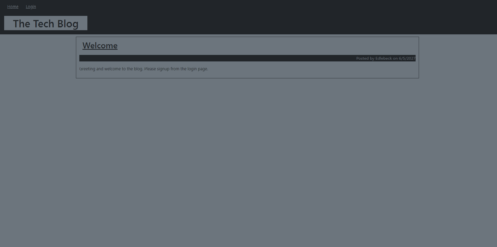

# MVC Challenge 

  ## Table of Contents
  - [Description](#description)
  - [Installation](#installation)
  - [Usage](#usage)
  - [Contributions](#contributing)
  - [Questions](#questions)

  
  ## Description
  This is blog to demonstrate the MVC basics through a full stack application. 
  
  
  ## Installation
  Clone the repository [MVC Challenge](https://github.com/edlebeck/tech-blog-challenge-edlebeck) and install the node dependencies.
  
  ## Usage
  Start your server using npm start, or go to [The Tech Blog](https://edlebeck-tech-blog.herokuapp.com/)
  
  ## Contributing
  Contribute through email or github.
  
  ## Questions
  Contact Information:
  - [Github page](https://github.com/edlebeck)
  - alan.edlebeck@gmail.com
